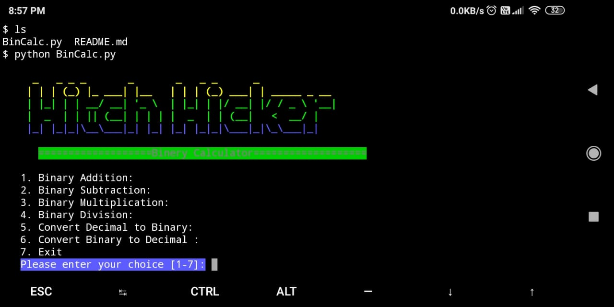

# BinCalc
python script for perform operations of binary numbers.

### Requirements:
python3

### Usage:
```
git clone https://github.com/hitchhicker007/BinCalc.git
cd BinCalc
python BinCalc.py
```

### Screenshot:

